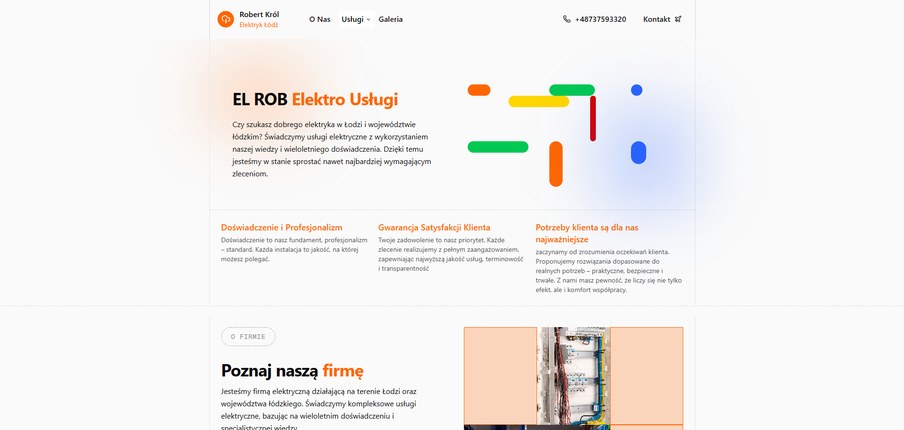

  

<h1 align="center">EL-ROB Elektro Usługi Łódź</h1>

  Strona internetowa firmy EL-ROB, świadczącej kompleksowe usługi elektryczne na terenie Łodzi i województwa łódzkiego. Projekt prezentuje ofertę, doświadczenie oraz realizacje  firmy, podkreślając rzetelność i fachowość w zakresie instalacji elektrycznych i serwisu.

---

<h2>Stack Technologiczny 🧰</h2>

| Stack                                   | Opis                                                                                   |
|----------------------------------------|----------------------------------------------------------------------------------------|
| [TypeScript](https://www.typescriptlang.org/) | Język programowania oparty na JavaScript.              |
| [Next.js](https://nextjs.org/)         | Framework oparty na React |
| [React](https://reactjs.org/)          | Biblioteka JavaScript do tworzenia interfejsów użytkownika.                           |
| [Tailwind CSS](https://tailwindcss.com/)| Narzędzie CSS oparte na klasach użytkowych, pozwalające na szybkie tworzenie UI.     |
| [Shadcn](https://ui.shadcn.com/)       | Zestaw dostępnych, komponowalnych komponentów UI opartych na Tailwind CSS i Radix UI. |
| [GitHub Actions](https://github.com/features/actions) | Narzędzie do automatyzacji zadań w repozytorium GitHub.                          |
| [Husky](https://typicode.github.io/husky/)| Narzędzie do uruchamiania skryptów Git hook, np. przed commitami lub pushami.         |
| [ESLint](https://eslint.org/)          | Narzędzie do lintowania kodu JavaScript/TypeScript.                         |
| [Prettier](https://prettier.io/)       | Narzędzie do automatycznego formatowania kodu.               |

--- 

--- 

## Na Żywo 🎆 

[https://elrob-elektro.pl/](https://elrob-elektro.pl/)

